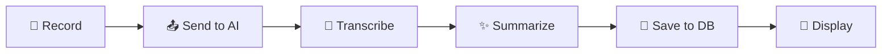

# VoiceNotes 🎙️

[](https://github.com/YOUR_USERNAME/VoiceNotes/actions/workflows/android.yml)
[](https://kotlinlang.org/)
[](https://android-arsenal.com/api?level=24)
[](LICENSE)

AI-powered voice notes app for Android. Record your thoughts, get instant transcription and smart summaries.

## ✨ Features

- 🎤 **Voice Recording** — One-tap recording with visual feedback and pulsating animation
- 🤖 **AI Transcription** — Automatic speech-to-text conversion
- 📝 **Smart Summaries** — AI-generated titles and summaries for each note
- 🔄 **Multiple AI Providers** — Support for Google Gemini and OpenAI
- 🔑 **BYOK** — Bring Your Own Key (API keys stored securely with EncryptedSharedPreferences)
- 📴 **Offline Mode** — Save drafts locally, retry when online
- 🌍 **Localization** — English and Russian languages
- 🎨 **Material Design 3** — Modern UI with dynamic theming (Material You)
- ♿ **Accessibility** — Full TalkBack support with content descriptions
- 🎧 **Audio Playback** — Listen to your recordings with play/pause controls

## 📱 Screenshots

| Notes List | Note Details | Settings | Onboarding |
|:----------:|:------------:|:--------:|:----------:|
|  |  |  |  |

## 🛠️ Tech Stack

| Category | Technology |
|----------|------------|
| Language | Kotlin 2.0 |
| UI | Jetpack Compose + Material 3 |
| Architecture | MVVM + Clean Architecture |
| DI | Hilt |
| Database | Room |
| Network | Retrofit + OkHttp |
| Preferences | DataStore + EncryptedSharedPreferences |
| Testing | JUnit + MockK + Turbine |
| CI/CD | GitHub Actions |

## 🚀 Getting Started

### Prerequisites

- Android Studio Hedgehog or later
- Android SDK 35
- JDK 17+

### API Keys

This app uses a **BYOK (Bring Your Own Key)** model. Get your API keys from:

| Provider | Link | Notes |
|----------|------|-------|
| Google Gemini | [Get Key](https://aistudio.google.com/app/apikey) | Recommended, handles both transcription & summarization |
| OpenAI | [Get Key](https://platform.openai.com/api-keys) | Optional, requires Gemini for transcription |

### Building

```bash
# Clone the repository
git clone https://github.com/YOUR_USERNAME/VoiceNotes.git
cd VoiceNotes

# Build debug APK
./gradlew assembleDebug

# Run tests
./gradlew testDebugUnitTest
```

## 📁 Project Structure

```
app/src/main/java/com/example/voicenotes/
├── ai/           # AI service interfaces (Gemini, OpenAI)
├── data/         # Room database, DAOs, Repository
├── di/           # Hilt dependency injection
├── navigation/   # Navigation routes
├── network/      # Retrofit API interfaces
├── ui/           # Compose screens & theme
├── util/         # Utilities (AudioPlayer, ErrorHandler)
├── MainActivity.kt
├── NotesListScreen.kt
└── NotesViewModel.kt
```

## 🔄 How It Works



1. **Record** — Tap FAB to start recording (with haptic feedback)
2. **Process** — Audio encoded to Base64, sent to AI provider
3. **Transcribe** — AI converts speech to text
4. **Summarize** — AI generates title and summary
5. **Store** — Note saved to local Room database
6. **Display** — UI updates automatically via StateFlow

## 🧪 Testing

```bash
# Run unit tests
./gradlew testDebugUnitTest

# Run with coverage
./gradlew testDebugUnitTestCoverage
```

## 🤝 Contributing

Contributions are welcome! See [CONTRIBUTING.md](CONTRIBUTING.md) for guidelines.

## 📄 License

This project is open source under the MIT License.

## 👨‍💻 Author

Made with ❤️ as a personal project to learn modern Android development.

---

⭐ Star this repo if you find it useful!
